# CASC-RL — System Flowcharts & Pipeline Diagrams
### Complete Visual Reference for All System Pipelines

> [!NOTE]
> This document contains **11 Mermaid diagrams** covering every major flow in the CASC-RL system —
> from individual satellite decision-making to the full training pipeline.
> Use these directly in papers, presentations, and README files.

---

## Diagram Index

| # | Diagram | What It Shows |
|---|---|---|
| 1 | [5-Layer System Architecture](#1-5-layer-system-architecture) | Full stack: L1 physics → L5 safety |
| 2 | [Per-Step Inference Pipeline](#2-per-step-inference-pipeline) | One simulation tick: observation → action |
| 3 | [Full Training Pipeline](#3-full-training-pipeline) | Phase 1→2→3: World Model → MARL → Curriculum |
| 4 | [World Model Training Flow](#4-world-model-training-flow) | Data collection → training → validation |
| 5 | [MAPPO Training Loop](#5-mappo-training-loop) | Rollout → GAE → PPO update cycle |
| 6 | [Algorithm 4: MPC Decision Tree](#6-algorithm-4-cognitive-mpc-decision-tree) | cognitive_decision() step-by-step |
| 7 | [Safety Monitor FSM](#7-safety-monitor-state-machine-fsm) | 5-state FSM with all transitions |
| 8 | [Layer 4 Coordination Pipeline](#8-layer-4-hierarchical-coordination-pipeline) | Coordinator → Allocator → Scheduler |
| 9 | [Evaluation Pipeline](#9-evaluation-and-benchmarking-pipeline) | experiment_runner orchestration |
| 10 | [Curriculum Training Stages](#10-curriculum-training-stages) | 6-stage progressive difficulty |
| 11 | [Full Data Flow Diagram](#11-complete-system-data-flow) | All data paths across all layers |

---

## 1. 5-Layer System Architecture

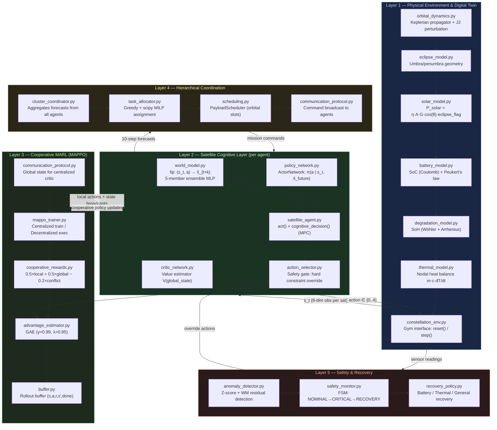

---

## 2. Per-Step Inference Pipeline

> One simulation tick: from environment observation to executed action.

```mermaid
flowchart TD
    START(["🛰️ Step t begins\n(dt = 10 seconds)"])

    subgraph ENV_UPDATE["Layer 1: Physics Update"]
        A1["OrbitalDynamics.propagate(t)\n→ ECI position, velocity"]
        A2["EclipseModel.check(pos, sun_vec)\n→ eclipse_flag ∈ {0, 1}"]
        A3["SolarModel.compute_power(eclipse, pos)\n→ P_solar (Watts)"]
        A4["BatteryModel.step(P_solar, P_consumed)\n→ SoC update (Peukert)"]
        A5["ThermalModel.step(eclipse, P_consumed)\n→ Temperature update"]
        A6["DegradationModel.step(SoC, T, cycles)\n→ SoH update"]
        A1 --> A2 --> A3 --> A4 --> A5 --> A6
    end

    subgraph OBS["Observation Construction"]
        B1["s_t = [SoC, SoH, Temp, P_solar,\nPhase, Eclipse, P_cons, CommDelay]\nshape: (8,) per satellite"]
    end

    subgraph SAFETY_CHECK["Layer 5: Anomaly Detection"]
        C1{"AnomalyDetector\nZ-score check"}
        C2["SoC < 0.15 OR\nTemp > 0.6?"]
        C3["Anomaly detected\n→ SafetyMonitor escalates FSM"]
        C4["NOMINAL — proceed\nto cognitive layer"]
        C1 --> C2
        C2 -- "YES" --> C3
        C2 -- "NO" --> C4
    end

    subgraph COGNITIVE["Layer 2: Cognitive Decision"]
        D1["WorldModel.predict_k_steps(s_t, k=5)\n→ ŝ_{t+1}...ŝ_{t+5}"]
        D2{"Decision mode?"}
        D3["ActorNetwork.forward(s_t, ŝ_future)\n→ action distribution\n→ sample a_t"]
        D4["cognitive_decision() MPC\nEnumerate 5 actions,\nscore each, pick best"]
        D5["ActionSelector.filter(a_t, s_t)\n→ safe_action\n(override if constraint violated)"]
        D1 --> D2
        D2 -- "Policy (MAPPO)" --> D3
        D2 -- "MPC (Algorithm 4)" --> D4
        D3 --> D5
        D4 --> D5
    end

    subgraph MARL["Layer 3: Cooperative"]
        E1["CommunicationProtocol.build_global_state()\n→ concat all local obs\nshape: (N_sat × 8,)"]
        E2["CentralizedCritic.forward(global_state)\n→ V(s) per agent"]
        E3["CooperativeRewardShaper\nr_shaped = 0.5·local + 0.5·global − 0.2·conflict"]
        E1 --> E2 --> E3
    end

    subgraph COORD["Layer 4: Coordination (every K steps)"]
        F1{"K-step\ncoordination\ninterval?"}
        F2["ClusterCoordinator.coordinate()\n→ aggregate 10-step forecasts"]
        F3["TaskAllocator.solve()\n→ assignment: {sat_id: task}"]
        F4["PayloadScheduler.schedule()\n→ temporal mission plan"]
        F1 -- "YES" --> F2 --> F3 --> F4
        F1 -- "NO" --> G1
    end

    subgraph EXEC["Environment Step"]
        G1["env.step(actions)\n→ next_obs, rewards, done"]
        G2["Store in RolloutBuffer\n(s, a, r, s', done, log_prob, value)"]
        G3["Accumulate episode reward\nUpdate TensorBoard logs"]
    end

    START --> ENV_UPDATE --> OBS --> SAFETY_CHECK
    C3 --> D5
    C4 --> D1
    D5 --> E1
    E3 --> G1
    COORD --> EXEC
    D5 --> COORD
    G1 --> G2 --> G3

    DONE(["✅ Step t+1 ready\n→ next tick"])
    G3 --> DONE

    style ENV_UPDATE fill:#1a2744,stroke:#3d6fa8
    style COGNITIVE fill:#1a3323,stroke:#3d8a5c
    style MARL fill:#1e2a1e,stroke:#5a9e5a
    style COORD fill:#2a2618,stroke:#9a8a3a
    style SAFETY_CHECK fill:#2a1a1a,stroke:#9a3a3a
    style EXEC fill:#1e1e2a,stroke:#6a6aac
```

---

## 3. Full Training Pipeline

```mermaid
flowchart LR
    subgraph P1["PHASE 1\ntrain_world_model.py"]
        direction TB
        P1A["ConstellationEnv(n_sat=3)"]
        P1B["Random Policy\n100,000 steps"]
        P1C["DatasetBuilder\nSave (s,a,s') → transitions.npz"]
        P1D["WorldModel Build\n5-ensemble MLPs\n256 hidden × 3 layers"]
        P1E["WorldModelTrainer.train()\nMSE loss, Adam lr=1e-3\n100 epochs, val=15%"]
        P1F["Checkpoint\nworld_model_best.pt\nworld_model_final.pt"]
        P1A --> P1B --> P1C --> P1D --> P1E --> P1F
    end

    subgraph P2["PHASE 2\ntrain_marl.py"]
        direction TB
        P2A["Load world_model_best.pt"]
        P2B["Build 3 × ActorNetwork\nBuild CentralizedCritic"]
        P2C["Build SatelliteAgents\n(actor + world model + safety gate)"]
        P2D["MAPPOTrainer\n5000 episodes × 1000 steps"]
        P2E["Every 200 steps:\nGAE → PPO clip × 10 epochs\nCritic MSE update"]
        P2F["Checkpoint\nmappo_best.pt\nmappo_final.pt"]
        P2A --> P2B --> P2C --> P2D --> P2E --> P2F
    end

    subgraph P3["PHASE 3\ncurriculum_training.py"]
        direction TB
        S1["Stage 1: 1 sat\nno eclipse — 1,000 ep."]
        S2["Stage 2: 1 sat\neclipse — 2,000 ep."]
        S3["Stage 3: 3 sats\neclipse — 2,000 ep."]
        S4["Stage 4: 3 sats\n+degradation — 2,000 ep."]
        S5["Stage 5: 6 sats\nfull stress — 3,000 ep."]
        S6["Stage 6: 12 sats\nadversarial — 5,000 ep."]
        S1 --"checkpoint →"--> S2 --"checkpoint →"--> S3 --"checkpoint →"--> S4 --"checkpoint →"--> S5 --"checkpoint →"--> S6
    end

    subgraph P4["PHASE 4\nexperiment_runner.py"]
        direction TB
        E1["Run 4 algorithms × 20 seeds"]
        E2["Compute all metrics\nMetricComputer.compute_all()"]
        E3["Welch t-test\nstatistical significance"]
        E4["Save JSON + CSV\nLaTeX table"]
        E1 --> E2 --> E3 --> E4
    end

    subgraph P5["PHASE 5\ngenerate_all_figures.py"]
        direction TB
        F1["25 comparison plots\n(learning, battery, safety, scaling)"]
        F2["Ablation charts\n(Layers 2-5)"]
        F3["Radar chart + heatmap\n+ LaTeX table"]
        F1 --> F2 --> F3
    end

    P1F --"pre-trained weights"--> P2A
    P2F --"actor weights"--> P3
    P3  --"trained agents"--> P4
    P4  --"results/ JSON"--> P5

    style P1 fill:#1a2744,stroke:#3d6fa8,color:#c0d8ff
    style P2 fill:#1a3323,stroke:#3d8a5c,color:#c0ffd0
    style P3 fill:#1e2a1e,stroke:#5a9e5a,color:#ddffd0
    style P4 fill:#2a2618,stroke:#9a8a3a,color:#fff0c0
    style P5 fill:#2a1a2a,stroke:#8a3a9a,color:#f0d0ff
```

---

## 4. World Model Training Flow

```mermaid
flowchart TD
    START(["python training/train_world_model.py"])

    A["Parse CLI args\n--n_satellites=3\n--n_transitions=100000\n--n_epochs=100\n--device=auto"]

    B{"--load_data flag\n& file exists?"}
    C["ConstellationEnv(n_satellites=3)\nRandom Policy collect loop"]
    D["DatasetBuilder.collect()\n100,000 × (s_t, a_t, s_{t+1})\nSave → data/transitions.npz"]
    E["TransitionDataset.from_npz()\nLoad existing dataset"]

    F["Split 85% train\n15% validation"]

    G["WorldModel.__init__()\nstate_dim=8, action_dim=5\nn_ensemble=5, hidden=256, layers=3"]

    H["Normalizer.fit(train_states)\nWelford online Z-score\nμ, σ per dimension"]

    I["For epoch 1..100:"]

    subgraph TRAIN_LOOP["Training Loop (per epoch)"]
        J["Sample minibatch (size=512)\nfrom training set"]
        K["Z-normalize: s̃ = (s-μ)/σ"]
        L["For each ensemble member e₁..e₅:\nForwardPass(s̃, a) → ŝ\nLoss = MSE(ŝ, s_{t+1}_normalized)\nAdam.step(loss)"]
        M["Per-dimension RMSE log\n[SoC=xxx, SoH=xxx, Temp=xxx]"]
        J --> K --> L --> M
    end

    subgraph VAL["Validation (per epoch)"]
        N["Evaluate on 15% held-out set\nMSE across all 5 members\nEnsemble mean prediction"]
        O{"val_loss <\nbest_val_loss?"}
        P["Save world_model_best.pt\n✓ New best!"]
        Q["Continue — no save"]
        N --> O
        O -- "YES" --> P
        O -- "NO" --> Q
    end

    R["Save world_model_final.pt\n(after all epochs)"]
    DONE(["✅ World model ready\n→ checkpoints/world_model_best.pt"])

    START --> A --> B
    B -- "NO" --> C --> D --> F
    B -- "YES" --> E --> F
    F --> G --> H --> I --> TRAIN_LOOP --> VAL --> I
    I --"epoch 100 done"--> R --> DONE

    style TRAIN_LOOP fill:#1a3323,stroke:#3d8a5c
    style VAL fill:#1a2744,stroke:#3d6fa8
```

---

## 5. MAPPO Training Loop

```mermaid
flowchart TD
    START(["python training/train_marl.py\nEpisode 1"])

    A["Reset environment\nobs, _ = env.reset(seed)"]

    subgraph ROLLOUT["Rollout Collection (200 steps)"]
        B["For each satellite i:\nactor_i.forward(obs_i) → dist\naction_i = dist.sample()\nlog_prob_i = dist.log_prob(action_i)"]
        C["critic.forward(global_obs)\n→ value (V)"]
        D["env.step(actions)\n→ next_obs, rewards, done"]
        E["CooperativeRewardShaper\nr_shaped = 0.5×mean(local_r)\n+ 0.5×global_r − 0.2×conflict"]
        F["RolloutBuffer.add(\n  s_local, s_global, action,\n  r_shaped, done, log_prob, value\n)"]
        B --> C --> D --> E --> F
        F --"next step"--> B
    end

    G["200 steps complete\n→ Compute returns"]

    subgraph GAE["GAE Advantage Estimation"]
        H["advantage_estimator.compute_gae(\n  rewards, values, dones\n  γ=0.99, λ=0.95\n)"]
        I["δₜ = rₜ + γ·V(sₜ₊₁)·(1-done) − V(sₜ)"]
        J["Aₜ = δₜ + (γλ)¹δₜ₊₁ + (γλ)²δₜ₊₂ + ..."]
        K["returns = advantages + values\n(normalize advantages: μ=0, σ=1)"]
        H --> I --> J --> K
    end

    subgraph PPO_UPDATE["PPO Update (10 epochs × 4 minibatches)"]
        L["For each actor i:\n  ratio = exp(log_prob_new − log_prob_old)\n  L_clip = min(ratio·A, clip(ratio, 0.8, 1.2)·A)\n  L_entropy = −H[π(·|s)]\n  actor_loss = −mean(L_clip) + 0.01·L_entropy"]
        M["actor_optimizer_i.zero_grad()\nactor_loss.backward()\ngradient clip norm=0.5\nactor_optimizer_i.step()"]
        N["critic_loss = MSE(critic(s_global), returns)\ncritic_optimizer.zero_grad()\ncritic_loss.backward()\ncritic_optimizer.step()"]
        L --> M --> N
    end

    O["Update old_log_probs\nfor next rollout"]

    P["TensorBoard log:\n  episode_reward, actor_loss,\n  critic_loss, entropy,\n  safety_override_rate"]

    Q{"episode_reward >\nbest_reward?"}
    R["Save mappo_best.pt ✓"]
    S["Continue"]

    T{"episode %\nsave_every == 0?"}
    U["Save mappo_ep{N}.pt"]

    V{"Episode N\n== max_episodes?"}
    DONE(["✅ Training complete\n→ checkpoints/mappo_best.pt"])
    NEXT["Episode N+1\n→ env.reset()"]

    START --> A --> ROLLOUT --> G --> GAE --> PPO_UPDATE
    PPO_UPDATE --> O --> P --> Q
    Q -- "YES" --> R --> T
    Q -- "NO" --> S --> T
    T -- "YES" --> U --> V
    T -- "NO" --> V
    V -- "NO" --> NEXT --> A
    V -- "YES" --> DONE

    style ROLLOUT fill:#1a3323,stroke:#3d8a5c
    style GAE fill:#1a2744,stroke:#3d6fa8
    style PPO_UPDATE fill:#2a1a2a,stroke:#8a3a9a
```

---

## 6. Algorithm 4: Cognitive MPC Decision Tree

> `SatelliteAgent.cognitive_decision(obs, k=5)` — per-satellite, per-step

```mermaid
flowchart TD
    START(["cognitive_decision(obs, k=5)\n called at step t"])

    A["Read local observation:\ns_t = [SoC, SoH, T, P_sol, Phase, Eclipse, P_cons, Delay]"]

    B["Normalize s_t via world model's\nZ-score normalizer"]

    subgraph ENUM["Enumerate All 5 Candidate Actions"]
        C0["a=0: payload_ON\n(high power: 25W)"]
        C1["a=1: payload_OFF\n(low power: 5W)"]
        C2["a=2: hibernate\n(ultra-low: 2W)"]
        C3["a=3: relay_mode\n(medium: 20W)"]
        C4["a=4: charge_priority\n(harvest max solar)"]
    end

    subgraph WM_ROLLOUT["World Model k=5 Step Rollout (per candidate)"]
        D["WorldModel.predict_k_steps(\n  s_t, actions=[a_cand]*5, k=5\n)"]
        E["Returns ŝ_{t+1}, ŝ_{t+2}, ..., ŝ_{t+5}\nEnsemble mean prediction"]
        D --> E
    end

    subgraph SCORE["Score Future State (Algorithm 4)"]
        F["score = w₁·ŝ_{t+5}[SoC]\n       − w₂·(SoH₀ − ŝ_{t+5}[SoH])\n       − w₃·max(0, ŝ_{t+5}[Temp] − 0.5)"]
        G["Weights:\n  w₁=1.0 (SoC is primary)\n  w₂=0.5 (penalize degradation)\n  w₃=0.3 (penalize thermal risk)"]
        F --> G
    end

    H["Record (candidate_action, score)\nRepeat for all 5 candidates"]

    I["best_action = argmax(score)\nover all 5 candidates"]

    subgraph SAFETY_GATE["Safety Filter (ActionSelector)"]
        J{"SoC < 0.15?"}
        K["Force: charge_priority (a=4)\n⚠ SAFETY OVERRIDE"]
        L{"Temp > 0.6\n(normalized ~60°C)?"}
        M["Force: hibernate (a=2)\n⚠ THERMAL OVERRIDE"]
        N{"best_action=payload_ON\nAND SoC < 0.30?"}
        O["Downgrade: relay_mode (a=3)\n⚠ WARNING DOWNGRADE"]
        P["Accept: best_action ✓"]
        J -- "YES" --> K
        J -- "NO" --> L
        L -- "YES" --> M
        L -- "NO" --> N
        N -- "YES" --> O
        N -- "NO" --> P
    end

    DONE(["Return safe_action\nto ConstellationEnv"])

    START --> A --> B --> ENUM
    ENUM --> WM_ROLLOUT --> SCORE --> H
    H --"all 5 done"--> I --> SAFETY_GATE --> DONE

    style ENUM fill:#1a2744,stroke:#3d6fa8
    style WM_ROLLOUT fill:#1a3323,stroke:#3d8a5c
    style SCORE fill:#1e2a1e,stroke:#5a9e5a
    style SAFETY_GATE fill:#2a1a1a,stroke:#9a3a3a
```

---

## 7. Safety Monitor State Machine (FSM)

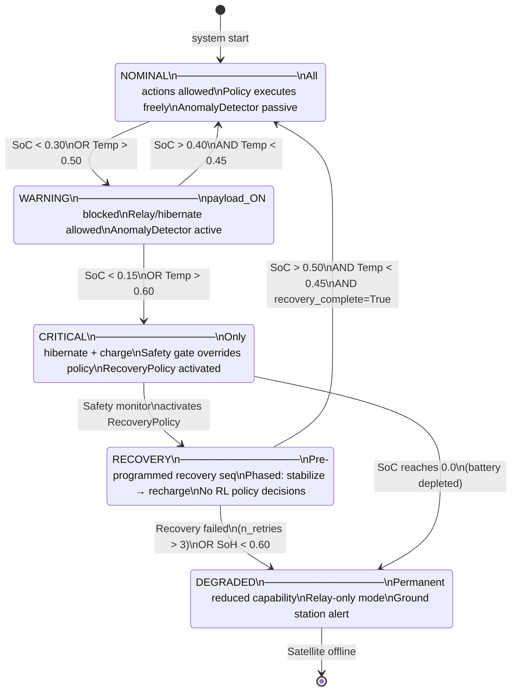

---

## 8. Layer 4 Hierarchical Coordination Pipeline

```mermaid
flowchart TD
    TRIGGER(["Coordination trigger\nevery K=50 steps"])

    subgraph COLLECT["Step 1: State Collection"]
        A["For each satellite i:\nagent_i.world_model.predict_k_steps(\n  obs_i, actions=[1]*10, k=10\n)"]
        B["10-step forecast per satellite\nŝ_1^{t+1..t+10}, ŝ_2^{t+1..t+10}, ..., ŝ_N^{t+1..t+10}"]
        A --> B
    end

    subgraph AGG["Step 2: ClusterCoordinator.aggregate()"]
        C["Stack forecasts:\nshape (N_sat, 10, 8)"]
        D["Compute fleet health metrics:\n  fleet_mean_soc = mean(ŝ[:,0])\n  n_eclipse_predicted = sum(ŝ[:,5] > 0.5)\n  thermal_risk_count = sum(ŝ[:,2] > 0.55)"]
        E["Assess fleet status:\n  GREEN / YELLOW / RED"]
        C --> D --> E
    end

    subgraph ALLOC["Step 3: TaskAllocator.solve()"]
        F{"Fleet status?"}
        G["All tasks eligible:\nscience payload + relay + monitor"]
        H["Restrict: no science payload\nfor sats with SoC < 0.35"]
        I["Emergency: hibernate low SoC sats\nRelay-only for others"]
        F -- "GREEN" --> G
        F -- "YELLOW" --> H
        F -- "RED" --> I

        J["Build assignment matrix:\nObjective: maximize mission_value × x_i\nConstraints:\n  • Sum power ≤ P_budget\n  • Each sat ≤ 1 task\n  • Respect SoC/thermal limits"]
        K["Solve with scipy.optimize.milp\n(fallback: greedy by value/power ratio)"]
        G --> J
        H --> J
        I --> J
        J --> K
    end

    subgraph SCHED["Step 4: PayloadScheduler.schedule()"]
        L["Build temporal schedule\nover next orbital period"]
        M["Assign time slots:\n  T_payload: when payload is ON\n  T_relay: ISL comm windows\n  T_eclipse: mandatory hibernate slots"]
        N["Priority queue:\n  EMERGENCY > RELAY > SCIENCE > MONITOR"]
        L --> M --> N
    end

    subgraph BCAST["Step 5: Command Broadcast"]
        O["CommunicationProtocol.broadcast(\n  assignment_dict: {sat_id: task}\n)"]
        P["Each agent receives:\n  • Assigned task label\n  • Time slot window\n  • Override flag (if emergency)"]
        O --> P
    end

    RESULT(["Agents update\ntheir local command buffers\n→ Resume RL execution"])

    TRIGGER --> COLLECT --> AGG --> ALLOC --> SCHED --> BCAST --> RESULT

    style COLLECT fill:#1a2744,stroke:#3d6fa8
    style AGG fill:#1a3323,stroke:#3d8a5c
    style ALLOC fill:#2a2618,stroke:#9a8a3a
    style SCHED fill:#2a1a2a,stroke:#8a3a9a
    style BCAST fill:#1e1e2a,stroke:#6a6aac
```

---

## 9. Evaluation and Benchmarking Pipeline

```mermaid
flowchart TD
    START(["python evaluation/experiment_runner.py\n--n_episodes 20 --n_satellites 3"])

    subgraph SETUP["Setup"]
        A["Load world_model_best.pt"]
        B["Load mappo_best.pt → actor weights"]
        C["Create seeds [0..19] (20 evaluation seeds)"]
        A --> B --> C
    end

    subgraph B1["Baseline A: PID Controller\nbaseline_pid.py"]
        D["PIDBaseline(Kp=2.0, Ki=0.05, Kd=0.5)\neclipse_boost=0.10\n20 episodes × 1000 steps"]
        E["Collect EpisodeResults\n(soc_trajectory, rewards,\n safety events, task completion)"]
        D --> E
    end

    subgraph B2["Baseline B: Rule-Based Scheduler\nbaseline_rule.py"]
        F["RuleBasedBaseline\n5-priority heuristic\n20 episodes × 1000 steps"]
        G["Collect EpisodeResults"]
        F --> G
    end

    subgraph A1["CASC-RL (MAPPO)\nLearned Actor Policy"]
        H["SatelliteAgents.act(deterministic=True)\n20 episodes × 1000 steps"]
        I["Collect EpisodeResults\n+ safety_override_steps"]
        H --> I
    end

    subgraph A2["CASC-RL (MPC)\nAlgorithm 4 cognitive_decision()"]
        J["SatelliteAgents.cognitive_decision(k=5)\n20 episodes × 1000 steps"]
        K["Collect EpisodeResults"]
        J --> K
    end

    subgraph METRICS["MetricComputer.compute_all()"]
        L["Battery: SoC_min, SoH_final,\nbattery_lifetime, DoD"]
        M["Mission: success_rate,\ntasks/orbit, coordination_eff"]
        N["Safety: thermal_viol/ep,\nsoc_critical/ep, override_rate"]
        O["Learning: convergence_step,\nreward_stability"]
        L --> M --> N --> O
    end

    subgraph STATS["Statistical Significance"]
        P["Welch t-test\nCASC-RL vs. each baseline\non total episode reward"]
        Q["Report: p-value, Cohen's d\nsignificant if p < 0.05"]
        P --> Q
    end

    subgraph OUTPUT["Output Files"]
        R["results/*.json\n(per algorithm metrics)"]
        S["results/comparison_n3.csv\n(paper table, LaTeX-ready)"]
        T["results/significance_n3.json\n(p-values, effect sizes)"]
        U["results/trajectories_*.json\n(SoC + reward curves for plots)"]
        R --> S --> T --> U
    end

    subgraph FIGURES["generate_all_figures.py"]
        V["25 matplotlib figures\n→ figures/*.pdf + *.png"]
        W["LaTeX table\n→ figures/table_comparison_n3.tex"]
        V --> W
    end

    START --> SETUP
    SETUP --> B1 --> METRICS
    SETUP --> B2 --> METRICS
    SETUP --> A1 --> METRICS
    SETUP --> A2 --> METRICS
    METRICS --> STATS --> OUTPUT --> FIGURES

    DONE(["✅ Full benchmark complete\nAll paper figures ready"])
    FIGURES --> DONE

    style B1 fill:#2a1a1a,stroke:#9a3a3a
    style B2 fill:#2a2618,stroke:#9a8a3a
    style A1 fill:#1a2744,stroke:#3d6fa8
    style A2 fill:#1a3323,stroke:#3d8a5c
    style METRICS fill:#2a1a2a,stroke:#8a3a9a
    style STATS fill:#1e2a1e,stroke:#5a9e5a
    style OUTPUT fill:#1e1e2a,stroke:#6a6aac
```

---

## 10. Curriculum Training Stages

```mermaid
flowchart LR
    subgraph S1["Stage 1"]
        direction TB
        S1T["1 Satellite\nNo Eclipse\nNominal conditions"]
        S1E["1,000 episodes\n1,000 steps/ep"]
        S1C["stage1_single_nominal.pt"]
        S1T --> S1E --> S1C
    end

    subgraph S2["Stage 2"]
        direction TB
        S2T["1 Satellite\nEclipse ON\nLearn eclipse strategy"]
        S2E["2,000 episodes"]
        S2C["stage2_single_eclipse.pt"]
        S2T --> S2E --> S2C
    end

    subgraph S3["Stage 3"]
        direction TB
        S3T["3 Satellites\nEclipse ON\nCollision avoidance\nBasic cooperation"]
        S3E["2,000 episodes"]
        S3C["stage3_three_nominal.pt"]
        S3T --> S3E --> S3C
    end

    subgraph S4["Stage 4"]
        direction TB
        S4T["3 Satellites\nEclipse + Degradation\nLearn SoH preservation\nLong-horizon planning"]
        S4E["2,000 episodes"]
        S4C["stage4_three_degradation.pt"]
        S4T --> S4E --> S4C
    end

    subgraph S5["Stage 5"]
        direction TB
        S5T["6 Satellites\nFull stress scenario\nCoordination critical\nHierarchical layer active"]
        S5E["3,000 episodes"]
        S5C["stage5_six_stress.pt"]
        S5T --> S5E --> S5C
    end

    subgraph S6["Stage 6"]
        direction TB
        S6T["12 Satellites\nAdversarial conditions\nAnomaly injection\nFull system stress"]
        S6E["5,000 episodes"]
        S6C["stage6_twelve_adversarial.pt"]
        S6T --> S6E --> S6C
    end

    WM["world_model_best.pt\n(pre-trained, shared\nacross all stages)"]

    START(["curriculum_training.py\n--start_stage 1 --end_stage 6"])
    START --> S1
    WM --> S1
    WM --> S2
    WM --> S3
    WM --> S4
    WM --> S5
    WM --> S6

    S1C --"transfer weights →"--> S2
    S2C --"transfer weights →"--> S3
    S3C --"transfer weights →"--> S4
    S4C --"transfer weights →"--> S5
    S5C --"transfer weights →"--> S6

    S6 --> DONE(["✅ Stage 6 complete\nFully trained CASC-RL system\n12-satellite constellation"])

    style S1 fill:#193019,stroke:#4a8a4a
    style S2 fill:#1e3519,stroke:#5a9a4a
    style S3 fill:#1a2a1a,stroke:#6aaa5a
    style S4 fill:#1a3322,stroke:#4a8a6a
    style S5 fill:#1a2a30,stroke:#4a7a9a
    style S6 fill:#1a1e30,stroke:#4a5aaa
```

---

## 11. Complete System Data Flow

> End-to-end data flow: what data is created, transformed, and consumed by each module.

```mermaid
flowchart TD
    subgraph INPUTS["Inputs & Configuration"]
        CFG_E["config/environment.yaml\nn_satellites, battery, thermal,\nsolar, orbital params"]
        CFG_T["config/training.yaml\nMAPPO hyperparams, lr, γ, λ, ε\ncurriculum stages"]
        CFG_C["config/constellation.yaml\nWalker-Delta orbit parameters\nISL comm links, task definitions"]
    end

    subgraph L1_DATA["Layer 1: Physics Data"]
        OBS["Observation Tensor\ns_t ∈ ℝ^(N_sat × 8)\n[SoC, SoH, T, P_sol, φ, ecl, P_cons, d_comm]"]
        REW["Reward Vector\nr_t ∈ ℝ^N_sat\n= w₁·SoC − w₂·ΔSoH − w₃·T_risk + w₄·mission"]
    end

    subgraph L2_DATA["Layer 2: Cognitive Data"]
        PRED["World Model Predictions\nŝ_{t+k} ∈ ℝ^(k × 8)\nk=5 step horizon"]
        ACT["Action Distribution\nπ(·|s_t, ŝ_future) ∈ Δ^5\n(Categorical over 5 actions)"]
        SAFE["Safe Action\na_safe ∈ {0,1,2,3,4}\n(after safety gate filter)"]
        VAL["Value Estimate\nV(s_global) ∈ ℝ\n(from centralized critic)"]
    end

    subgraph L3_DATA["Layer 3: MARL Data"]
        GLOB["Global State\ns_global ∈ ℝ^(N_sat × 8)\n(concatenated for critic)"]
        ADV["GAE Advantages\nA_t ∈ ℝ^T\n(normalized, zero-mean)"]
        ROLLBUF["Rollout Buffer\n(s_local, s_global, a, r_shaped,\n done, log_prob, value)\n× 200 steps"]
        SHAPED_R["Shaped Reward\nr_shaped = 0.5·local + 0.5·global\n− 0.2·conflict_flag"]
    end

    subgraph L4_DATA["Layer 4: Coordination Data"]
        FORECAST["Fleet Forecast\nshape: (N_sat, 10, 8)\n10-step horizon all satellites"]
        ASSIGN["Task Assignment\n{sat_id: task_label}\nfrom MILP solver"]
        SCHEDULE["Temporal Schedule\n{sat_id: [(t_start, t_end, task)]}\nfor next orbital period"]
    end

    subgraph L5_DATA["Layer 5: Safety Data"]
        ZSCORE["Z-score Anomaly\nresidual = |s_actual − ŝ_predicted|\nflagged if > 3σ"]
        FSM_STATE["FSM State\n∈ {NOMINAL, WARNING,\nCRITICAL, RECOVERY, DEGRADED}"]
        OVERRIDE["Override Action\na_override (if constraint violated)\nreplaces learned action"]
    end

    subgraph TRAINING_DATA["Training Artifacts"]
        TRANSITIONS["transitions.npz\n100,000 × (s_t, a_t, s_{t+1})\n~45 MB"]
        WM_CKPT["world_model_best.pt\nEnsemble weights + normalizer\n~8 MB"]
        MAPPO_CKPT["mappo_best.pt\n3 × actor_state_dict\n+ critic_state_dict\n~12 MB"]
        CURR_CKPTS["curriculum/stage{N}_{name}.pt\n6 stage checkpoints\n~12 MB each"]
    end

    subgraph RESULTS["Evaluation Outputs"]
        EP_RESULT["EpisodeResult objects\nper algorithm × per seed\n(soc_traj, rewards, events)"]
        METRICS_JSON["results/*.json\nall 5 metric categories\nper algorithm"]
        TABLE_CSV["comparison_n3.csv\npaper Table 1 ready"]
        FIGURES["figures/*.pdf + *.png\n25 comparison plots\n+ ablation charts"]
        LATEX["table_comparison_n3.tex\nLaTeX-ready table\nwith siunitx formatting"]
    end

    CFG_E --> L1_DATA
    CFG_C --> L1_DATA
    CFG_T --> TRAINING_DATA

    OBS --> L2_DATA
    OBS --> L3_DATA
    OBS --> L5_DATA
    OBS --> L4_DATA

    PRED --> ACT
    ACT --> SAFE
    SAFE --> L1_DATA
    VAL --> ADV

    GLOB --> VAL
    SHAPED_R --> ADV
    ADV --> ROLLBUF
    ROLLBUF --> MAPPO_CKPT

    FORECAST --> ASSIGN --> SCHEDULE --> SAFE

    ZSCORE --> FSM_STATE --> OVERRIDE --> SAFE

    TRANSITIONS --> WM_CKPT
    WM_CKPT --> PRED
    MAPPO_CKPT --> ACT
    MAPPO_CKPT --> CURR_CKPTS

    L1_DATA --> EP_RESULT
    L2_DATA --> EP_RESULT
    L5_DATA --> EP_RESULT
    EP_RESULT --> METRICS_JSON --> TABLE_CSV --> FIGURES --> LATEX

    style INPUTS fill:#1e1e2a,stroke:#6a6aac
    style L1_DATA fill:#1a2744,stroke:#3d6fa8
    style L2_DATA fill:#1a3323,stroke:#3d8a5c
    style L3_DATA fill:#1e2a1e,stroke:#5a9e5a
    style L4_DATA fill:#2a2618,stroke:#9a8a3a
    style L5_DATA fill:#2a1a1a,stroke:#9a3a3a
    style TRAINING_DATA fill:#2a1a2a,stroke:#8a3a9a
    style RESULTS fill:#1a2a2a,stroke:#3a9a9a
```

---

## Quick Reference — Algorithm Summary

| Algorithm | Location | Inputs | Outputs | Key Math |
|---|---|---|---|---|
| **Alg 1** — Environment Simulation | [constellation_env.py](file:///d:/AIandDS_HUB/Projects/CASC-RL/environment/constellation_env.py) | orbital params, actions | [s_t](file:///d:/AIandDS_HUB/Projects/CASC-RL/environment/thermal_model.py#120-123) (8-dim obs) | Keplerian, Coulomb, Nodal therm. |
| **Alg 2** — World Model Learning | [world_model/training.py](file:///d:/AIandDS_HUB/Projects/CASC-RL/world_model/training.py) | [(s,a,s')](file:///d:/AIandDS_HUB/Projects/CASC-RL/world_model/world_model.py#300-304) dataset | `f_ψ` checkpoint | `L = ‖s_{t+1} − f_ψ(s_t,a_t)‖²` |
| **Alg 3** — MAPPO Training | [marl/mappo_trainer.py](file:///d:/AIandDS_HUB/Projects/CASC-RL/marl/mappo_trainer.py) | env, actors, critic | policy weights | `L_PPO = min(r·A, clip(r,0.8,1.2)·A)` |
| **Alg 4** — MPC Decision | [agents/satellite_agent.py](file:///d:/AIandDS_HUB/Projects/CASC-RL/agents/satellite_agent.py) | [s_t](file:///d:/AIandDS_HUB/Projects/CASC-RL/environment/thermal_model.py#120-123), world model | safe action | `score = w₁SoC − w₂ΔSoH − w₃T_risk` |
| **Alg 5** — Coordination | [coordination/cluster_coordinator.py](file:///d:/AIandDS_HUB/Projects/CASC-RL/coordination/cluster_coordinator.py) | fleet forecasts | `{sat_id: task}` | MILP: `max Σ v_i·x_i` s.t. power ≤ P |
